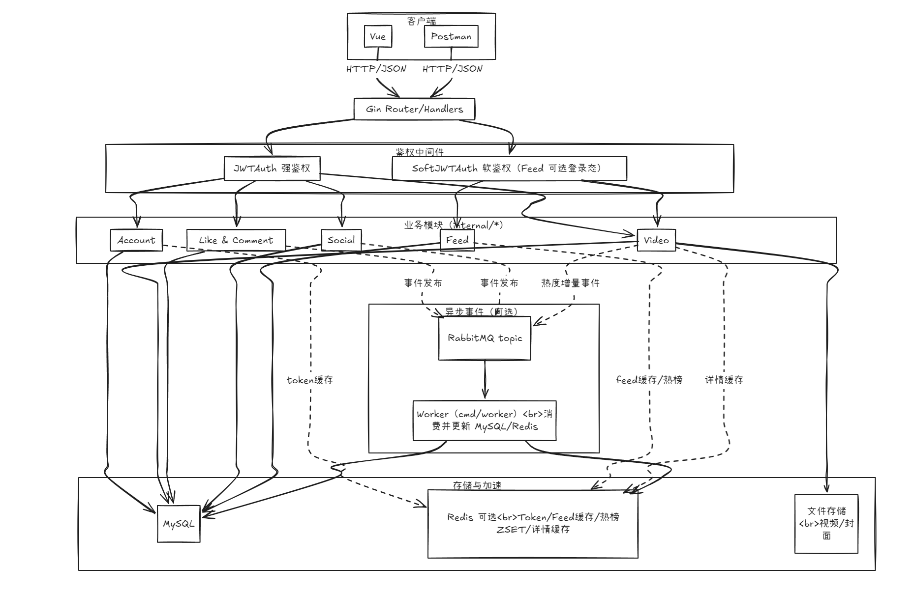

# VideoHub

VideoHub 是一个基于 Go 开发的视频内容社区，支持账号登录、视频上传与发布、点赞评论、关注关系、互动通知、WebSocket 私信、视频流浏览和热视频排行，并提供独立构建的桌面端与沉浸式手机端页面。

项目采用 **API + Worker 双进程模型**：API 负责鉴权、限流和同步写入核心业务数据；Worker 负责 Outbox 消息投递、RabbitMQ 消费、热度更新、缓存维护和文件删除。视频文件默认保存在本地，也可以通过环境变量切换至阿里云 OSS 私有 Bucket。

> 当前项目已完成本地与 Docker 容器集成验证，适用于学习和作品展示，尚未进行真实生产环境的大规模上线。

## 技术栈

| 模块 | 技术 |
| --- | --- |
| 后端 | Go、Gin、GORM、JWT |
| 前端 | Vue 3、TypeScript、Vite、Vue Router、Pinia、Nginx，桌面端与手机端独立构建 |
| 数据库 | MySQL 8 |
| 缓存与排行 | Redis、Redis ZSET、go-cache |
| 消息队列 | RabbitMQ |
| 实时通信 | WebSocket、Redis Pub/Sub |
| 文件存储 | 本地文件系统、阿里云 OSS 私有 Bucket |
| 并发控制 | MySQL 事务、行锁、singleflight |
| 容器化 | Docker、Docker Compose |

## 核心功能

| 模块 | 已实现功能 |
| --- | --- |
| 账号 | 唯一账号名注册/登录、中文公开昵称、头像上传与动态默认头像、退出、修改密码、查询用户 |
| 鉴权 | JWTAuth 强鉴权、SoftJWTAuth 软鉴权、token 主动撤销 |
| 视频 | 上传封面、上传视频、分片上传、合并分片、发布、详情、作者视频、状态删除 |
| 视频流 | 最新视频流、关注视频流、点赞排行、热视频榜 |
| 点赞 | 点赞、取消点赞、判断是否点赞、我的点赞列表 |
| 评论 | 发表评论、删除评论、评论列表 |
| 关注 | 关注、取消关注、粉丝列表、关注列表 |
| 通知 | 点赞、评论、关注异步通知、未读数、标记已读、消息页面 |
| 私信 | WebSocket 实时收发、会话请求、三条消息额度、接收者回复即接受、互关直聊、已读回执、拉黑、未读数 |
| 客户端 | 桌面沉浸式播放、手机竖屏滑动、双端评论互动、响应式布局、自动设备分流 |
| 工程能力 | Outbox、消费幂等、独立通知队列、三级缓存、冷热分离、限流、Docker Compose |

## 双端客户端体验

桌面端和手机端共享同一套后端接口，但保持独立的页面结构和构建产物。两端使用统一的深色视觉语言、状态反馈和账号数据，不强行将桌面页面缩放成手机页面。

### 桌面端

- 使用侧边导航、顶部搜索和居中视频舞台，兼容宽屏、普通桌面和小屏桌面。
- 推荐流和关注流支持自动播放、上下切换、播放暂停、静音切换、点赞、关注、评论和分享。
- 支持键盘操作：`↑` / `↓` 切换视频、`Space` 播放或暂停、`M` 切换声音、`C` 打开评论、`Esc` 关闭弹层。
- 评论抽屉打开时暂停当前视频，关闭后只在视频原本处于播放状态时恢复。
- 发布页面支持视频预览、封面预览、真实上传进度和大文件分片上传，并在上传期间阻止误离开页面。
- 消息筛选、用户主页、个人中心和视频详情均提供加载、空数据、错误与重试状态。
- 私信支持实时收发、断线重连、历史消息分页、已读状态、请求接受/拒绝和拉黑。

### 手机端

- 使用 `100dvh`、`safe-area-inset-top` 和 `safe-area-inset-bottom` 适配移动浏览器地址栏、刘海和底部安全区。
- 推荐、关注和热门视频流采用一屏一个视频的纵向滚动吸附，只播放当前可见视频，快速滑动时自动暂停其他视频。
- 页面进入后台时暂停视频，恢复页面后仅按之前的播放状态恢复当前视频。
- 支持单击播放或暂停、双击点赞、长描述展开、静音切换、关注、评论、分享和游标分页。
- 评论 Bottom Sheet 支持遮罩关闭、`Esc` 关闭、焦点管理、背景滚动锁定、评论发布和删除。
- 消息未读数由 Pinia Store 统一维护；个人中心支持作品、喜欢、关注、粉丝、改名、改密码和删除作品。
- 私信页面按移动端单列交互实现，支持实时消息、会话列表、已读回执和消息请求处理。
- 发布页面支持手机常见视频格式、上传前预览、封面选择、分片上传进度和上传期间路由保护。

### 播放与格式说明

- 为满足浏览器自动播放策略，视频默认静音播放。页面显示“开启声音”表示当前处于静音状态，点击后才会播放声音；有声时按钮显示“关闭声音”。
- 当前支持上传 `MP4`、`MOV`、`M4V`、`WebM`、`3GP` 和 `3GPP`，视频最大 200 MB，封面支持 JPG、PNG、WebP，最大 10 MB。
- 大于 10 MB 的视频自动按 5 MB 分片上传，小文件使用单次上传并展示真实网络进度。
- 部分 iPhone 拍摄的 HEVC/MOV 文件可能可以上传，但当前浏览器无法直接预览或播放。跨设备稳定播放仍需要后续增加服务端转码。

### 前端可靠性

- Feed、消息、用户主页和详情请求使用请求序号隔离，快速切换页面或筛选时，旧响应不会覆盖新状态。
- 点赞、关注、评论、删除、登录和发布操作具备请求中禁用或防重复提交处理。
- 视频 DOM 引用、`IntersectionObserver`、事件监听器、`requestAnimationFrame` 和预览 Object URL 会在切换或卸载时清理。
- 登录状态支持同源浏览器标签页同步；退出登录或切换账号时清理旧的关注、点赞、消息和个人资料状态。
- API 层兼容空响应、非 JSON 错误、401 登录失效、413 文件过大和上传网络异常。
- 主要图标按钮具备 `aria-label`，评论弹层支持焦点管理，并适配 `prefers-reduced-motion`。

## 系统架构



```text
Desktop / Mobile Browser
  |
HTTP / WebSocket Gateway（生产环境按设备分流）
  |
Desktop Vue / Mobile Vue + Nginx
  |
  | /api reverse proxy
  v
Go API + WebSocket Hub
  |-- 参数校验 / JWT / Redis 限流
  |-- 同步写 MySQL 业务表
  |-- 同事务写 outbox_msgs
  |-- 上传文件至 Local Storage / OSS
  |
  +----> Redis：token、缓存、时间线、热榜、实时事件 Pub/Sub
  |
  +----> MySQL：核心业务数据、私信会话与消息、Outbox、消费记录
              |
              | Outbox Poller
              v
          RabbitMQ
              |
              v
            Worker
              |-- 消费幂等
              |-- 更新热度和热榜
              |-- 维护视频时间线
              |-- 清理缓存和实际文件
```

## 核心设计

### Outbox Pattern

业务写库和 MQ 投递之间存在双写一致性问题：MySQL 写入成功后，RabbitMQ 可能发送失败。

项目将业务数据和待发送事件放在同一个 MySQL 事务中提交：

```text
同步修改业务表
-> 同事务写 outbox_msgs
-> Poller 扫描 pending 消息
-> 条件更新 pending -> publishing，抢占消息
-> 发布 RabbitMQ
-> 成功后标记 published
-> 失败后恢复 pending 并记录 retry_count / last_error
```

多个 Worker 同时扫描到一条 Outbox 时，通过条件更新和 `RowsAffected` 判断谁抢占成功。卡在 `publishing` 超过一分钟的消息会被恢复为 `pending`。

当前通过 Outbox 投递的事件：

| 事件 | 同步主链路 | Worker 后置任务 |
| --- | --- | --- |
| `video_published` | 写视频和 Outbox | 写 Redis 时间线、清理旧视频流缓存 |
| `video_deleted` | 视频状态改为 deleted、写 Outbox | 清理 Redis、删除本地或 OSS 文件 |
| `like_created` / `like_deleted` | 修改点赞关系和点赞数、写 Outbox | 更新热度、同步热榜、删除详情缓存 |
| `comment_published` / `comment_deleted` | 修改评论、写 Outbox | 更新热度、同步热榜 |
| 通知事件 | 点赞、评论、关注事务写通知 Outbox | 幂等写入 notifications 表 |

### MQ 消费幂等

RabbitMQ 消息可能因为 ACK 丢失或消费失败而被重复投递。项目使用 `consumed_events` 表记录已处理事件，并通过 `(event_id, consumer_name)` 联合唯一索引保证：

- 同一个消费者只能处理一次相同事件。
- 同一个事件未来可以被热度、通知、统计等不同消费者分别处理。

消费记录和 MySQL 热度更新放在同一个事务中。Redis 热榜不盲目重复执行 `ZINCRBY`，而是读取 MySQL 最终热度后使用 `ZADD` 覆盖 score，使 Redis 最终结果与 MySQL 一致。

### Redis 时间线与冷热分离

最新视频流使用 Redis ZSET 保存最近 1000 条视频：

```text
key    = feed:global_timeline
member = video_id
score  = 发布时间毫秒时间戳
```

Redis 时间线最老数据的时间作为冷热边界：

```text
请求时间 > 冷热边界：从 Redis 读取热数据 ID
请求时间 <= 冷热边界：从 MySQL 读取历史冷数据
Redis 数据不足一页：继续从 MySQL 补齐
```

Redis 时间线为空时，从 MySQL 重建最近 1000 条 published 视频，并使用 singleflight 避免并发重复重建。

### 三级缓存与 singleflight

根据视频 ID 查询完整实体时使用：

```text
L1：进程内 go-cache，约 5 秒
-> L2：Redis video:entity:{id}，1 小时
-> L3：MySQL videos 表
```

同一视频缓存失效时，singleflight 合并当前 API 进程内的并发回源请求，减少重复查询 MySQL。视频详情缓存使用互斥锁和双重检查控制缓存重建。

### Redis 热榜

热视频榜使用 Redis ZSET：

```text
key    = feed:hot:zset
member = video_id
score  = popularity
```

点赞和评论事件由 Worker 异步更新 MySQL 热度，再用最终热度覆盖 Redis score。热榜查询优先从 Redis 获取排序后的 ID，再批量查询 published 视频；Redis 无数据时回退 MySQL。

### 业务正确性与并发控制

- 点赞、点赞数和 Outbox 在同一个 MySQL 事务中提交。
- 重复点赞使用唯一索引、`OnConflict DoNothing` 和 `RowsAffected` 实现请求幂等。
- 点赞、取消点赞和发表评论时使用 `SELECT ... FOR UPDATE` 锁定 published 视频，避免删除过程中继续产生互动。
- 视频删除使用 `WHERE id = ? AND status = published` 条件更新，重复删除不会重复创建 Outbox。
- 所有公开查询只返回 published 视频。
- API 同步清理关键缓存，Worker 消费删除事件后再次兜底清理。

### 文件存储与私有 OSS

业务层通过统一的 `Storage` 接口访问文件：

```go
type Storage interface {
    Upload(ctx context.Context, objectKey string, reader io.Reader) error
    Delete(ctx context.Context, objectKey string) error
    URL(ctx context.Context, objectKey string, expires time.Duration) (string, error)
}
```

默认使用本地存储；配置 OSS 环境变量后切换为阿里云 OSS。

私有 OSS 的签名 URL 会过期，因此数据库只保存稳定的 `object_key`。查询视频时，后端根据 ObjectKey 生成新的临时签名 URL。视频被删除后，Worker 异步删除 OSS 或本地实际文件。

### JWT 鉴权与 Redis 限流

- 登录身份与公开昵称分离：`account_name` 是忽略大小写的唯一登录账号，`username` 是支持中文且可修改的公开昵称。
- 老数据库启动时会自动补齐 `account_name`；迁移账号暂时保留旧昵称登录兼容，新注册账号只使用 `account_name + password` 登录。
- 用户可以在网页端和手机端账号设置中上传 JPG、PNG 或 WebP 头像（最大 5MB）；未上传头像时由后端生成稳定的彩色 SVG 默认头像。
- JWTAuth 用于必须登录的发布、点赞、评论和关注接口。
- SoftJWTAuth 用于公开视频流：未登录可以访问，登录用户额外返回用户态信息。
- token 同时保存在 MySQL 和 Redis；退出登录时删除服务端 token，使旧 JWT 立即失效。
- 登录和注册按 IP 限流；点赞、评论和关注按账号限流。
- Redis 不可用时限流采用 fail-open，优先保证核心业务可用。

### WebSocket 私信与实时通知

- 浏览器先通过 JWT 保护的接口获取 30 秒一次性 WebSocket ticket，再连接 `/ws`；ticket 在 Redis 中原子读取并删除，不能重复使用。
- WebSocket Hub 支持同一账号多设备连接、心跳保活、慢连接清理和发送队列隔离。
- API 和 Worker 通过 Redis Pub/Sub 发布实时事件，因此多 API 实例之间也能把私信和点赞、评论、关注通知推送到正确连接。
- 私信正文、会话状态、未读数和已读游标以 MySQL 为准；实时事件丢失时客户端可通过 REST 接口补拉，不会丢失正式消息。
- 非互关用户由一方发起消息请求，接收者回复或主动接受后双方可正常聊天；在此之前发起者最多发送三条。互关用户可直接聊天，任意一方拉黑后双方都不能继续发送。
- 每条消息带客户端幂等 ID，会话发送使用事务和行锁串行修改三条额度及未读数，避免并发绕过规则。

## 一键启动

环境要求：

- Docker Desktop 或 Docker Engine
- Docker Compose

默认使用本地文件存储，无需配置 OSS：

```bash
docker compose up -d --build
```

访问地址：

| 服务 | 地址 |
| --- | --- |
| 桌面端页面 | http://localhost:5173 |
| 手机端页面 | http://localhost:5174 |
| 后端 API | http://localhost:8080 |
| RabbitMQ 管理台 | http://localhost:15672 |
| MySQL | localhost:3307 |
| Redis | localhost:6379 |

首次打开视频流时浏览器会以静音方式自动播放，点击视频可以播放或暂停，点击“开启声音”后才会输出声音。手机端也可以直接访问 `http://localhost:5174`，无需依赖自动设备分流。

RabbitMQ 本地演示账号：

```text
admin / password123
```

停止容器但保留数据：

```bash
docker compose stop
```

停止并删除容器：

```bash
docker compose down
```

停止并删除容器与数据卷：

```bash
docker compose down -v
```

### 升级已有环境

从旧版升级到包含唯一账号名、头像和 WebSocket 私信的版本后，需要重新构建并启动容器：

```bash
git pull
docker compose up -d --build
```

API 启动时会自动补齐账号字段，并创建私信会话、消息和拉黑关系表，无需手工执行 SQL。升级前签发的 JWT 不包含 `account_name`，如果页面账号名未正常显示，请退出后重新登录。

## 可选：启用阿里云 OSS

使用私有 OSS Bucket 时，在仓库根目录创建 `.env`：

```dotenv
STORAGE_TYPE=oss
OSS_ENDPOINT=https://oss-cn-shanghai.aliyuncs.com
OSS_REGION=oss-cn-shanghai
OSS_BUCKET_NAME=your-bucket-name
OSS_ACCESS_KEY_ID=your-ram-access-key-id
OSS_ACCESS_KEY_SECRET=your-ram-access-key-secret
```

建议使用仅拥有目标 Bucket 必要权限的 RAM 用户 AccessKey，不要使用阿里云主账号 AccessKey。

`.env` 已被 `.gitignore` 排除，不应提交到 Git。

配置后重新构建并启动：

```bash
docker compose up -d --build
```

## 云服务器 HTTP 一键部署

只有公网 IP、暂时不使用 HTTPS 时：

```bash
git clone https://github.com/JChengPro/videohub.git
cd videohub
cp .env.production.example .env
```

修改 `.env` 中所有 `CHANGE_ME` 密码和 `JWT_SECRET`，然后执行：

```bash
docker compose -f docker-compose.prod.yml up -d --build
```

生产 Compose 只对公网开放 `80` 端口。访问 `http://服务器公网IP` 时，手机浏览器自动进入手机端，电脑浏览器自动进入桌面端。

生产部署参数分别见 [`docker-compose.prod.yml`](docker-compose.prod.yml) 和 [`.env.production.example`](.env.production.example)。

## 项目结构

```text
.
├── backend/
│   ├── cmd/main.go                    # API 入口
│   ├── cmd/worker/main.go             # Worker 入口
│   ├── internal/account/              # 账号模块
│   ├── internal/config/               # YAML 加载与环境变量覆盖
│   ├── internal/feed/                 # 视频流、冷热分离、三级缓存
│   ├── internal/message/              # 私信会话、消息策略和已读状态
│   ├── internal/middleware/           # JWTAuth / SoftJWTAuth
│   ├── internal/mq/                   # RabbitMQ 和事件结构
│   ├── internal/notification/         # 点赞、评论、关注通知及实时推送
│   ├── internal/ratelimit/            # Redis 接口限流
│   ├── internal/realtime/             # WebSocket Hub、ticket 和 Redis Pub/Sub
│   ├── internal/social/               # 关注模块
│   ├── internal/storage/              # Local / OSS 存储实现
│   ├── internal/video/                # 视频、点赞、评论、Outbox
│   ├── internal/worker/               # Poller 和 MQ Consumer
│   └── Dockerfile                     # API / Worker 多阶段构建
├── frontend/                          # Vue 3 桌面端前端
│   └── src/                           # 框架、视频流、发布、消息、账号和详情页面
├── mobile-frontend/                   # Vue 3 手机端前端
│   └── src/                           # 竖屏视频流、评论弹层、底部导航和业务页面
├── picture/                           # 架构图和表结构图
├── test/                              # Postman 测试集合
├── docker-compose.yml                 # 服务编排
├── docker-compose.prod.yml            # 生产环境服务编排
├── 项目设计.md                         # 项目设计说明
└── README.md
```

## 接口概览

| 模块 | 接口 |
| --- | --- |
| 账号 | `/account/register`、`/account/login`、`/account/checkAccountName`、`/account/findByID`、`/account/findByUsername`、`/account/search`、`/account/changePassword`、`/account/rename`、`/account/avatar`、`/account/avatar/:id`、`/account/me`、`/account/logout` |
| 视频 | `/video/uploadCover`、`/video/uploadVideo`、`/video/uploadChunk`、`/video/chunkStatus`、`/video/mergeChunks`、`/video/publish`、`/video/getDetail`、`/video/listByAuthorID`、`/video/delete` |
| 视频流 | `/feed/listLatest`、`/feed/listByFollowing`、`/feed/listLikesCount`、`/feed/listByPopularity` |
| 点赞 | `/like/like`、`/like/unlike`、`/like/isLiked`、`/like/listMyLikedVideos` |
| 评论 | `/comment/publish`、`/comment/delete`、`/comment/listAll` |
| 关注 | `/social/follow`、`/social/unfollow`、`/social/getAllFollowers`、`/social/getAllVloggers` |
| 通知 | `/notification/list`、`/notification/unreadCount`、`/notification/markRead`、`/notification/markAllRead` |
| 私信 | `/message/listConversations`、`/message/listMessages`、`/message/send`、`/message/markRead`、`/message/accept`、`/message/reject`、`/message/block`、`/message/unblock`、`/message/unreadCount` |
| 实时通信 | `/realtime/wsTicket`、`GET /ws` |

## 本地开发

只启动依赖：

```bash
docker compose up -d mysql redis rabbitmq
```

启动 API：

```bash
cd backend
go run ./cmd
```

启动 Worker：

```bash
cd backend
go run ./cmd/worker
```

启动前端：

```bash
cd frontend
npm install
npm run dev
```

启动手机端前端：

```bash
cd mobile-frontend
npm install
npm run dev
```

执行生产构建检查：

```bash
cd frontend
npm run build

cd ../mobile-frontend
npm run build
```

## 当前验证情况

- 后端 `go test ./...` 全部通过。
- 后端 `go vet ./...` 静态检查通过。
- 桌面端 `vue-tsc -b && vite build` 生产构建通过。
- 手机端 `vue-tsc -b && vite build` 生产构建通过。
- `docker compose config --quiet` 配置解析通过。
- 本地 Docker 端到端流程已覆盖桌面端/手机端代理、WebSocket 连接、三条消息限额、会话接受、已读、互关、取消互关、拉黑和消息幂等。
- 本地存储和阿里云私有 OSS 存储链路已验证。
- OSS 文件上传、ObjectKey 发布、签名 URL 访问和异步删除链路已验证。

生产构建只能验证 TypeScript、Vue 模板和打包流程。自动播放授权、虚拟键盘、刘海安全区、摄像视频编码和弱网上传仍建议在实际 Chrome、Safari、Android 和 iPhone 设备上回归。

## 后续优化方向

- 增加 Outbox 失败消息告警、指数退避、死信队列和重放接口。
- 增加 OSS 孤儿对象定时清理、客户端直传和 CDN。
- 增加视频转码与多码率输出，统一处理 HEVC、MOV 等移动设备视频编码。
- 为两套前端增加 Playwright 端到端测试和移动设备视口回归。
- 补充 Prometheus、Grafana、结构化日志和链路追踪。
- 补充并发、故障场景的自动化单元测试与集成测试。
- 将固定窗口限流升级为滑动窗口或令牌桶。
