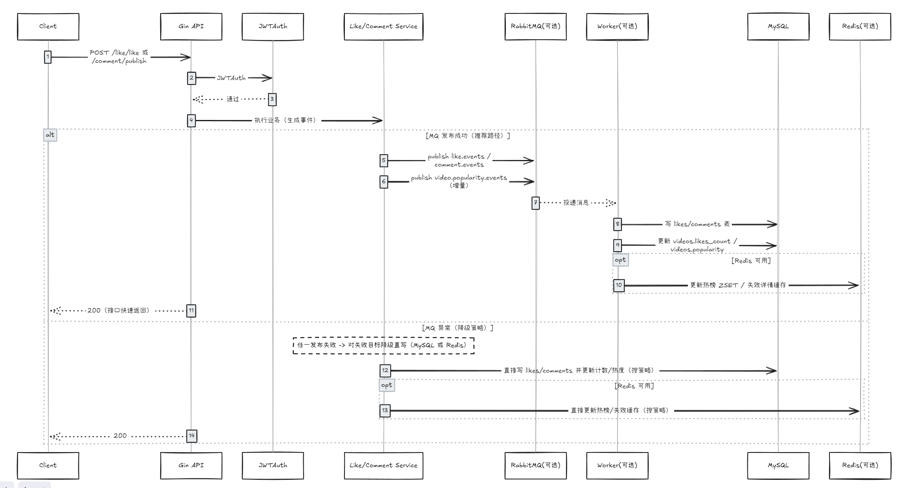

# feedsystem_go 项目设计

> 基于 Go 开发的短视频 Feed 流系统，提供账号、视频、点赞、评论、关注（Social）与 Feed 等接口，使用 Redis 和 RabbitMQ 优化性能。

# 技术栈

| 维度          | 组件/工具                | 说明                                                         |
| ------------- | ------------------------ | ------------------------------------------------------------ |
| 开发语言      | Go (Golang)              | 后端核心业务逻辑实现（API + Worker）。                       |
| Web 框架      | Gin                      | HTTP 路由注册、参数绑定、统一返回与中间件链（JWTAuth / SoftJWTAuth）。 |
| ORM 框架      | GORM                     | 模型定义、CRUD、启动时 AutoMigrate 自动迁移表结构。          |
| 持久化        | MySQL                    | 存储 `accounts / videos / likes / comments / socials` 五张核心表。 |
| 缓存/排行榜   | Redis（可选）            | Token 校验缓存、Feed 流缓存、视频详情缓存、热榜 ZSET。       |
| 消息队列      | RabbitMQ（可选）         | 异步处理热度更新、排行榜刷新、缓存失效；写库全部走同步。     |
| 异步执行      | Worker（Go）             | `cmd/worker`：LikeWorker / CommentWorker / VideoWorker，异步更新热度/排行/缓存。 |
| 文件存储      | Local Disk               | 视频与封面文件存放本地目录。                                 |
| 容器化/编排   | Docker / Docker Compose  | 一键拉起全部服务，便于部署和本地联调。                       |
| 前端          | Vue + Vite               | 前端工程 `frontend/`，通过 Vite 代理对接后端。               |

# 模块设计

## 用户系统

### 表设计

### 相关接口

| 路由                            | 输入 -> 输出                     | 鉴权   | 说明                                   |
| ------------------------------- | -------------------------------- | ------ | -------------------------------------- |
| POST `/account/register`        | `{username,password}` -> `{}`    | 无     | 注册；密码 bcrypt 哈希入库。           |
| POST `/account/login`           | `{username,password}` -> `{token}` | 无   | 登录成功返回 JWT；Redis 缓存 token。   |
| POST `/account/changePassword`  | `{username,old_password,new_password}` -> `{}` | 无 | 修改密码后需重新登录。       |
| POST `/account/findByID`        | `{id}` -> `{account}`            | 无     | 按 ID 查用户。                         |
| POST `/account/findByUsername`  | `{username}` -> `{account}`      | 无     | 按用户名查用户。                       |
| POST `/account/rename`          | `{new_username}` -> `{token}`    | JWT    | 改名并生成新 JWT；旧 token 立即失效。  |
| POST `/account/me`              | `{}` -> `{account_id,username}`  | JWT    | 获取当前登录用户信息。                 |
| POST `/account/logout`          | `{}` -> `{}`                     | JWT    | 清空 token，旧 token 立即失效。        |

## 视频系统

### 表设计

### 相关接口

| 路由                          | 输入 -> 输出                            | 鉴权   | 说明                           |
| ----------------------------- | --------------------------------------- | ------ | ------------------------------ |
| POST `/video/publish`         | `{title,description,play_url,cover_url}` -> `{video}` | JWT | 发布视频。           |
| POST `/video/listByAuthorID`  | `{author_id}` -> `{videos[]}`           | 无     | 作者主页视频列表。             |
| POST `/video/getDetail`       | `{id}` -> `{video}`                     | 无     | 视频详情，支持 Redis 缓存。    |
| POST `/video/uploadCover`     | `multipart: file` -> `{cover_url}`      | JWT    | 上传封面图。                   |
| POST `/video/uploadVideo`     | `multipart: file` -> `{play_url}`       | JWT    | 上传视频文件。                 |
| POST `/video/delete`          | `{id}` -> `{}`                          | JWT    | 仅作者可删除。                 |

## 点赞系统

### 表设计

### 架构说明

点赞**同步写入 DB**（likes 表 + likes_count 事务更新），然后通过 RabbitMQ 异步更新热度和缓存。

### 相关接口

| 路由                      | 输入 -> 输出                   | 鉴权 | 说明                                       |
| ------------------------- | ------------------------------ | ---- | ------------------------------------------ |
| POST `/like/isLiked`      | `{video_id}` -> `{is_liked}`   | JWT  | 判断当前用户是否点赞该视频。               |
| POST `/like/like`         | `{video_id}` -> `{}`           | JWT  | 同步写库 + 异步热度 +1 / 清详情缓存。      |
| POST `/like/unlike`       | `{video_id}` -> `{}`           | JWT  | 同步写库 + 异步热度 -1 / 清详情缓存。      |
| POST `/like/listMyLikedVideos` | `{}` -> `{videos[]}`      | JWT  | 列出当前用户点赞过的视频。                 |

## 评论系统

### 表设计

### 架构说明

评论**同步写入 DB**，然后通过 RabbitMQ 异步更新热度（popularity +2/-2）和热榜排行。

### 相关接口

| 路由                     | 输入 -> 输出                     | 鉴权 | 说明                               |
| ------------------------ | -------------------------------- | ---- | ---------------------------------- |
| POST `/comment/listAll`  | `{video_id}` -> `{comments[]}`   | 无   | 列出某视频全部评论。               |
| POST `/comment/publish`  | `{video_id,content}` -> `{comment}` | JWT | 同步写库返回完整评论（含 id、时间）。 |
| POST `/comment/delete`   | `{comment_id}` -> `{}`           | JWT  | 仅作者可删。                       |

## 关注系统

### 表设计

### 架构说明

关注/取关**同步写入 DB**（无 MQ 异步）。

### 相关接口

| 路由                          | 输入 -> 输出                     | 鉴权 | 说明                               |
| ----------------------------- | -------------------------------- | ---- | ---------------------------------- |
| POST `/social/follow`         | `{vlogger_id}` -> `{}`           | JWT  | 关注用户。                         |
| POST `/social/unfollow`       | `{vlogger_id}` -> `{}`           | JWT  | 取关用户。                         |
| POST `/social/getAllFollowers` | `{vlogger_id?}` -> `{followers}` | JWT  | 查询粉丝列表。                     |
| POST `/social/getAllVloggers`  | `{follower_id?}` -> `{vloggers}` | JWT  | 查询关注列表。                     |

## Feed 系统

### 返回结构体

Feed 返回 `FeedVideoItem`，包含嵌套 `author` 对象、毫秒时间戳 `create_time` 和 `is_liked` 状态，方便前端直接渲染。

### 相关接口

| 路由                          | 输入 -> 输出                                                   | 鉴权      | 说明                                           |
| ----------------------------- | -------------------------------------------------------------- | --------- | ---------------------------------------------- |
| POST `/feed/listLatest`       | `{limit,latest_time}` -> `{video_list,next_time,has_more}`     | SoftJWT   | 最新视频流，游标分页；首页可缓存。             |
| POST `/feed/listLikesCount`   | `{limit,likes_count_before,id_before}` -> `{video_list,...}`   | SoftJWT   | 按点赞数排序，复合游标 `(likes_count,id)` 分页。 |
| POST `/feed/listByPopularity` | `{limit,as_of,offset}` -> `{video_list,as_of,next_offset,...}` | SoftJWT   | 热门流，优先 Redis ZSET。                      |
| POST `/feed/listByFollowing`  | `{limit,latest_time}` -> `{video_list,next_time,has_more}`     | JWT       | 关注流，需登录。                               |

### 表关系

# Redis 优化

| 业务模块      | 数据类型 | Key 模式                     | TTL    | 说明                                     |
| ------------- | -------- | ---------------------------- | ------ | ---------------------------------------- |
| 鉴权 Token    | STRING   | `account:<id>`               | 24h    | 优先查 Redis；未命中回退 MySQL。         |
| Feed 流缓存   | STRING   | `feed:latest:limit=*`        | 30s    | 仅缓存首页第一页。                       |
| 视频详情缓存  | STRING   | `video:detail:id=<id>`       | 5m     | 点赞/评论变化时主动删除。                |
| 实时热榜      | ZSET     | `feed:hot:zset`              | -      | ZINCRBY 更新分数，ZREVRANGE 分页查询。   |

# RabbitMQ 异步任务

| 队列                      | 触发时机         | Worker            | 做什么                                   |
| ------------------------- | ---------------- | ----------------- | ---------------------------------------- |
| `like.events`             | 点赞 / 取消点赞  | LikeWorker        | 热度 ±1 + 更新热榜 + 清视频详情缓存      |
| `comment.events`          | 发评论 / 删评论  | CommentWorker     | 热度 ±2 + 更新热榜                       |
| `video.popularity.events` | 发布视频         | VideoWorker       | 清空 `feed:latest:*` 首页缓存            |

> **架构原则**：点赞、评论、关注的 DB 写入全部走同步，RabbitMQ 只负责热度计算、排行榜更新和缓存失效——用户不直接等待且失败不影响主流程的后台任务。

# 整体架构

# 流程图

## 整体流程

## 核心子流程

### 登录/鉴权/撤销 token

### 点赞/评论：同步写库 + 异步热度更新

### Feed 软鉴权 + 缓存/热榜 + 分页游标

# 亮点

| 维度       | 亮点                 | 说明                                                         |
| ---------- | -------------------- | ------------------------------------------------------------ |
| 缓存       | 鉴权缓存自愈机制     | 优先查 Redis；失效回退 MySQL，通过后回填 Redis。             |
| 缓存       | 主动失效             | 点赞/评论/发布视频后主动删除相关缓存。                       |
| 分页       | 复合游标分页         | `/feed/listLikesCount` 使用 `(likes_count, id)` 双字段游标，避免排序不稳定。 |
| 鉴权       | 软硬鉴权兼容         | JWTAuth（强制）+ SoftJWTAuth（可选），匿名浏览与登录态兼顾。 |
| 稳定性     | Redis 降级           | Redis 不可用时自动回退 MySQL。                               |
| 异步       | MQ 事件驱动          | 写库走同步，热度/缓存走异步，接口响应快、架构解耦。          |
| 工程       | Docker Compose 一键  | 全服务容器化，一键启动。                                     |
| 工程       | AutoMigrate 自动建表 | GORM 启动时自动同步表结构，开箱即用。                        |
