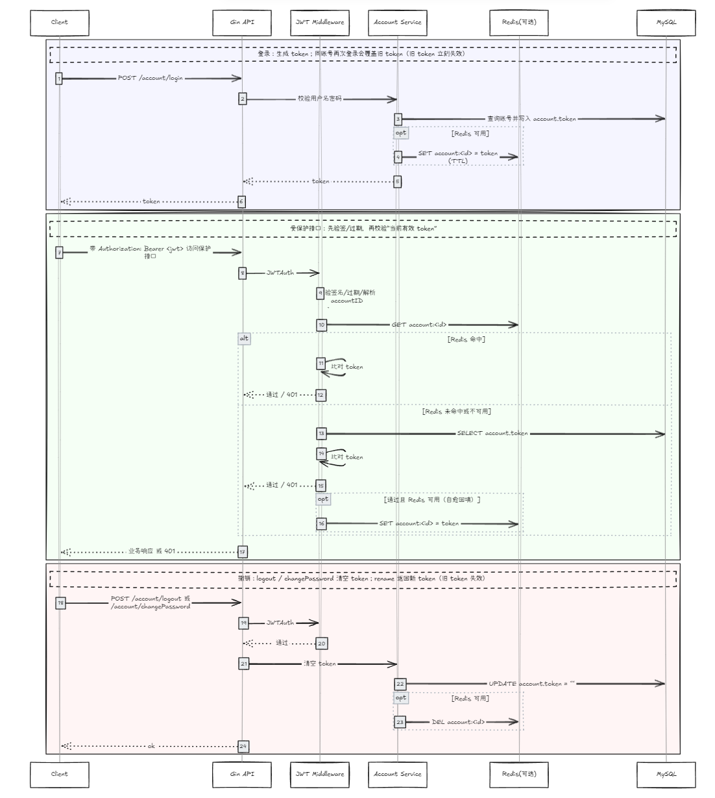

# VideoHub 项目设计  

VideoHub 是一个视频内容社区，后端基于 Go + Gin + GORM，前端基于 Vue3 + Vite。项目目标是实现从账号、视频、点赞评论、关注关系到视频流浏览和容器化部署的一套完整后端工程。

## 1. 技术栈

| 维度 | 组件/工具 | 说明 |
| --- | --- | --- |
| 后端语言 | Go | API 与 Worker 双进程 |
| Web 框架 | Gin | 路由、参数绑定、中间件 |
| ORM | GORM | CRUD 与 AutoMigrate |
| 数据库 | MySQL 8 | 核心业务数据与 Outbox 消息 |
| 缓存 | Redis | token、限流、视频时间线、视频实体缓存、热榜 |
| 本地缓存 | go-cache | 视频实体 L1 本地内存缓存 |
| 消息队列 | RabbitMQ | 后置事件异步消费 |
| 实时通信 | WebSocket + Redis Pub/Sub | 私信、通知实时推送与多 API 实例分发 |
| 前端 | Vue3 + Vite + TypeScript | 桌面端与手机端独立构建，共用后端接口 |
| 文件存储 | Storage 接口、本地文件系统、阿里云 OSS | 保存视频、封面和头像对象 |
| 部署 | Docker Compose | 一键启动 MySQL、Redis、RabbitMQ、API、Worker 和双端前端 |

## 2. 总体架构

以下文本架构以当前 `main` 分支代码为准；`picture/` 中的 PNG 为早期设计资料，不再作为当前架构依据。

```text
Desktop / Mobile Browser
  -> Desktop Vue / Mobile Vue + Nginx
  -> HTTP / WebSocket
backend API + WebSocket Hub
  -> 参数校验 / JWT / 限流
  -> 同步写 MySQL，事务内写 outbox_msgs
  -> Redis：token、缓存、限流、时间线、热榜、实时事件 Pub/Sub
  -> Local Storage / OSS：视频、封面和头像
worker
  -> Outbox Poller 使用独立 Publisher Channel 发布 MQ
  -> 四个 RabbitMQ Consumer 使用各自 Channel 处理缓存、热度、时间线和通知
mysql
  -> 业务数据、私信消息、通知、Outbox 和消费记录的最终存储
```

## 3. API + Worker 双进程

| 进程 | 入口 | 职责 |
| --- | --- | --- |
| API | `backend/cmd/main.go` | 提供 HTTP 接口，处理同步主链路 |
| Worker | `backend/cmd/worker/main.go` | 启动 Outbox Poller，消费 RabbitMQ 队列 |

API 和 Worker 共用同一个 `backend/Dockerfile`，通过多阶段构建分别输出 `/app/api` 和 `/app/worker`。Docker Compose 中 `backend` 服务使用 `target: api`，`worker` 服务使用 `target: worker`。

## 4. 数据模型

核心表：

| 表 | 作用 |
| --- | --- |
| `accounts` | 唯一登录账号名、公开昵称、密码哈希、头像对象路径、token |
| `videos` | 视频元信息、稳定对象路径、点赞数、热度和发布状态 |
| `likes` | 用户点赞关系 |
| `comments` | 评论数据 |
| `socials` | 关注关系 |
| `outbox_msgs` | 待投递 MQ 的可靠事件 |
| `consumed_events` | MQ 消费幂等记录 |
| `notifications` | 点赞、评论和关注通知及已读状态 |
| `conversations` | 私信会话状态、消息请求额度、未读数和已读游标 |
| `messages` | 私信正文和客户端幂等 ID |
| `blocks` | 私信拉黑关系 |

当前表结构由 `backend/internal/db.AutoMigrate` 和各模块 Entity 定义共同维护，上表是当前模型范围；`picture/` 中的旧表关系图仅保留作早期设计记录。

## 5. Outbox Pattern

### 作用

Outbox 用来解决“业务写库成功，但 MQ 发送失败”的双写一致性问题。

项目中点赞、评论、视频发布/删除都采用：

```text
同步写业务表
-> 同一个 MySQL 事务写 outbox_msgs
-> Poller 异步读取 outbox_msgs 并发布 RabbitMQ
-> Consumer 执行后置任务
```

### 状态流转

```text
pending
  -> publishing
  -> published
```

发送失败时：

```text
publishing -> pending
retry_count + 1
last_error 记录错误
```

如果 worker 崩溃导致消息长期停在 `publishing`，`ResetStalePublishingOutbox` 会把超时消息恢复为 `pending`。

### 并发处理

Poller 抢占消息时使用条件更新：

```text
UPDATE outbox_msgs
SET status = 'publishing'
WHERE id = ? AND status = 'pending'
```

MySQL 执行这类 `UPDATE` 时会对命中的行加排他锁，只有 `RowsAffected == 1` 的 worker 才算抢到消息。这个机制解决的是“多个 worker 同时扫描到同一条 outbox 记录”的问题。

Consumer 的幂等处理解决的是“同一条 MQ 消息可能被重复消费”的问题。两者关注点不同。

### 已接入事件

| 事件 | 事务内同步操作 | 异步后置操作 |
| --- | --- | --- |
| `video_published` | 写 `videos` + 写 outbox | 写 Redis 视频时间线，删除旧视频流缓存 |
| `video_deleted` | 将视频状态改为 `deleted` + 写 outbox | 从 Redis 时间线移除，清理缓存并删除本地或 OSS 实际文件 |
| `like_created` | 写 `likes`，更新 `videos.likes_count`，写 outbox | `popularity +1`，更新热榜，删详情缓存 |
| `like_deleted` | 删除 `likes`，更新 `videos.likes_count`，写 outbox | `popularity -1`，更新热榜，删详情缓存 |
| `comment_published` | 写 `comments`，写 outbox | `popularity +2`，更新热榜 |
| `comment_deleted` | 删除 `comments`，写 outbox | `popularity -2`，更新热榜 |
| 点赞、评论、关注通知事件 | 事务内写通知 Outbox | 幂等写入 `notifications`，通过 Redis Pub/Sub 实时推送 |

### RabbitMQ Connection 与 Channel 隔离

API 和 Worker 各自复用一个进程级 RabbitMQ Connection。Channel 按并发角色隔离，不允许 Outbox Publisher、Consumer 和 HTTP 请求共享同一条 Channel：

```text
API RabbitMQ Connection
└── HTTP MQ 测试请求临时 Channel（请求结束关闭）

Worker RabbitMQ Connection
├── Outbox Publisher Channel
├── Video Consumer Channel
├── Like Consumer Channel
├── Comment Consumer Channel
└── Notification Consumer Channel
```

`RabbitMQ` 类型只管理 Connection，`AMQPChannel` 管理队列声明、发布、消费和自己的关闭生命周期。Outbox Poller 和每个 Consumer 都在所属 goroutine 中创建 Channel；单个 Consumer 初始化失败时只记录错误并退出该消费者，不直接终止整个 Worker。

Docker 实测时 Worker 保持 5 条长期 Channel，其中 Publisher 的 `consumer_count=0`，四个 Consumer 的 `consumer_count=1`；API 平时没有长期 Channel，调用 `/mq/publish` 后临时 Channel 会正常关闭。

该阶段尚未实现 RabbitMQ 自动重连、Publisher Confirm、QoS/prefetch 和死信队列。

### MQ 消费幂等

RabbitMQ 消息可能因为 ACK 丢失或处理失败而重复投递。Worker 使用 `consumed_events` 表和 `(event_id, consumer_name)` 联合唯一索引保证同一个消费者只处理一次同一事件；不同消费者仍可分别处理同一个事件。MySQL 中的消费记录与热度更新放在同一事务中，Redis 热榜使用 MySQL 最终热度覆盖 score，避免重复消费造成累计偏差。

## 6. 最新视频流

### 6.1 Redis 时间线

最新流的热数据存在 Redis ZSET：

```text
key = Redis 视频时间线
member = video_id
score = 视频发布时间毫秒时间戳
```

视频发布后，worker 消费 `video_published`，把 `video_id` 和发布时间写入 Redis 视频时间线。视频删除后，worker 从 Redis 视频时间线移除对应 `video_id`。

时间线只保留最新 1000 条：

```text
按 rank 删除旧数据，只保留最新 1000 条
```

这样 Redis 只保存高频访问的最新视频，旧数据继续保存在 MySQL。

### 6.2 冷热分离

冷热分离的边界是 Redis 视频时间线中最老一条数据的 score：

```text
watermark = ZSET 最老视频的 create_time
```

读取最新视频流：

```text
如果 Redis 时间线为空：
  singleflight 只让一个请求从 MySQL 重建最近 1000 条

如果 reqTime <= watermark：
  已经翻到冷数据区，直接查 MySQL

如果 reqTime > watermark：
  还在热数据区，从 Redis ZSET 倒序取 video_id

如果 Redis 热数据不够一页：
  再从 MySQL 补齐剩余冷数据
```

### 6.3 singleflight

`singleflight` 用于进程内并发去重，避免缓存失效时重复查 MySQL。

| Key | 场景 |
| --- | --- |
| `sf:fallback:global_timeline_rebuild` | Redis 时间线为空时重建 |
| `sf:cold:listLatest:{limit}:{reqTime}` | 冷数据分页查库 |
| `sf:stitch:listLatest:{remainLimit}:{cursor}` | 冷热边界补数据 |
| `sf:entity:{videoID}` | 视频实体缓存 miss 后查 MySQL |

`singleflight` 内部由库 `golang.org/x/sync/singleflight` 实现，项目在视频流业务中定义 `requestGroup singleflight.Group` 并调用 `Do(key, fn)`。

### 6.4 三级缓存

Redis 时间线只保存视频 ID，完整视频信息通过 `GetVideoByIDs` 查询：

```text
L1：go-cache 本地内存缓存
L2：Redis，key = video:entity:{id}
L3：MySQL videos 表
```

L1 初始化：

```go
localcache.New(3*time.Second, 5*time.Second)
```

第一个参数是默认 TTL，第二个参数是过期数据清理间隔。项目写入视频实体时显式指定 `5*time.Second`，所以该场景下 L1 视频实体实际缓存约 5 秒。

L2 Redis 写入 TTL 为 1 小时。L3 MySQL 查询处使用 `singleflight`，多个 goroutine 写同一个 `videoMap` 时使用 `sync.Mutex` 保护，因为 Go map 并发写不安全。

最终通过 `buildOrderedResult` 按 Redis ZSET 返回的 video_id 顺序重新组装，避免 map 无序导致视频流顺序错乱。

## 7. 热榜

热榜使用 Redis ZSET：

```text
key = Redis 热榜 ZSET
member = video_id
score = popularity
```

点赞/取消点赞：

```text
MySQL popularity +1 / -1
Worker 读取 MySQL 最终 popularity
Redis ZADD 覆盖热榜最终 score
删除 video:detail 缓存
```

评论发布/删除：

```text
MySQL popularity +2 / -2
Worker 读取 MySQL 最终 popularity
Redis ZADD 覆盖热榜最终 score
```

热视频榜优先从 Redis ZSET 取 video_id，再回表查询视频详情并按 ZSET 顺序重排。Redis 没有数据时回退 MySQL。

## 8. 账号、鉴权和限流



### JWT 鉴权

- `account_name` 是全局唯一的登录账号；新注册账号必须为 6–12 位纯数字，历史字母账号继续兼容登录。
- `username` 是对外展示的公开昵称，支持中文且允许修改；修改昵称不会改变登录账号。
- 旧数据库由启动迁移自动补齐账号名，新账号以数据库唯一索引防止并发重复注册。
- 头像复用统一 Storage 接口，支持本地卷和 OSS；未上传头像时公开头像接口返回稳定的彩色 SVG。
- 登录成功后生成 JWT。
- token 同时写入 MySQL 和 Redis。
- JWTAuth 强鉴权用于必须登录的接口。
- SoftJWTAuth 用于视频流等公开接口：不带 token 也能访问，带合法 token 时写入 `accountID`，用于返回 `is_liked`。
- 退出登录会清空 MySQL token 并删除 Redis token，使旧 token 立即失效。

### 接口限流

限流计数存在 Redis：

| 场景 | key 前缀 | 策略 |
| --- | --- | --- |
| 登录 | `account_login` | 按 IP，10 次/分钟 |
| 注册 | `account_register` | 按 IP，5 次/小时 |
| 点赞 | `like_write` | 按账号，30 次/分钟 |
| 评论 | `comment_write` | 按账号，10 次/分钟 |
| 关注 | `social_write` | 按账号，20 次/分钟 |

## 9. WebSocket 私信与实时通知

WebSocket 只承担实时传输，MySQL 是会话、消息、未读数和已读游标的事实来源；实时事件丢失后，客户端可以通过 REST 接口补拉。

```text
客户端通过 JWT 请求 /realtime/wsTicket
-> Redis 保存 30 秒一次性 ticket
-> 客户端使用 ticket 连接 /ws
-> ticket 原子读取并删除，不能重放
-> WebSocket Hub 管理同一账号的多设备连接
-> API / Worker 通过 Redis Pub/Sub 将消息和通知分发到正确连接
```

- 非互关用户可以发起消息请求，接收者未回应前发起者最多发送 3 条文字消息。
- 接收者可以阅读、回复、接受或拒绝；第一次回复会自动接受会话。
- 互关用户直接进入完整聊天；取消互关后保留历史和已接受关系。
- 任意一方拉黑后双方停止发送，解除拉黑后恢复原有会话状态。
- `(sender_id, client_message_id)` 唯一索引防止断线重发产生重复消息。
- Hub 使用心跳、发送队列和慢连接清理隔离不同客户端连接。

## 10. 模块接口

### 账号

| 路由 | 鉴权 | 说明 |
| --- | --- | --- |
| POST `/account/register` | 无 | 注册 |
| POST `/account/login` | 无 | 使用唯一账号名登录 |
| POST `/account/checkAccountName` | 无 | 检查账号名是否可用 |
| POST `/account/changePassword` | JWT | 修改密码 |
| POST `/account/findByID` | 无 | 按 ID 查询用户 |
| POST `/account/findByUsername` | 无 | 按用户名查询用户 |
| POST `/account/search` | 无 | 按账号名或公开昵称搜索用户 |
| POST `/account/me` | JWT | 当前用户信息 |
| POST `/account/logout` | JWT | 退出登录 |
| POST `/account/rename` | JWT | 修改公开昵称 |
| POST `/account/avatar` | JWT | 上传或更换头像 |
| GET `/account/avatar/:id` | 无 | 获取上传头像或动态默认头像 |

### 视频

| 路由 | 鉴权 | 说明 |
| --- | --- | --- |
| POST `/video/uploadCover` | JWT | 上传封面 |
| POST `/video/uploadVideo` | JWT | 小文件直传（≤10MB） |
| POST `/video/uploadChunk` | JWT | 分片上传一片 |
| POST `/video/chunkStatus` | JWT | 查询已传分片 |
| POST `/video/mergeChunks` | JWT | 合并分片为完整文件 |
| POST `/video/publish` | JWT | 发布视频 |
| POST `/video/getDetail` | 无 | 视频详情 |
| POST `/video/listByAuthorID` | 无 | 作者视频列表 |
| POST `/video/delete` | JWT | 删除视频 |

视频上传采用智能分片策略：前端根据文件大小自动选择直传（≤10MB）或分片上传（>10MB），每片 5MB，支持进度条和断点续传。

### 视频流

| 路由 | 鉴权 | 说明 |
| --- | --- | --- |
| 最新视频流 | SoftJWT | Redis 时间线 + 冷热分离 |
| 关注视频流 | JWT | 按关注关系查询 |
| 点赞数视频流 | SoftJWT | 复合游标 |
| 热视频榜 | SoftJWT | Redis ZSET 优先 |

### 点赞、评论、关注

| 模块 | 路由 |
| --- | --- |
| 点赞 | `/like/like`, `/like/unlike`, `/like/isLiked`, `/like/listMyLikedVideos` |
| 评论 | `/comment/publish`, `/comment/delete`, `/comment/listAll` |
| 关注 | `/social/follow`, `/social/unfollow`, `/social/getAllFollowers`, `/social/getAllVloggers` |

### 通知、私信与实时连接

| 模块 | 路由 |
| --- | --- |
| 通知 | `/notification/list`、`/notification/unreadCount`、`/notification/markRead`、`/notification/markAllRead` |
| 私信 | `/message/listConversations`、`/message/listMessages`、`/message/send`、`/message/markRead`、`/message/accept`、`/message/reject`、`/message/block`、`/message/unblock`、`/message/unreadCount` |
| WebSocket | `/realtime/wsTicket`、`/ws` |

## 11. Docker Compose

`docker-compose.yml` 编排：

```text
mysql
redis
rabbitmq
backend API
worker
frontend
mobile-frontend
```

后端容器使用：

```text
backend/configs/config.docker.yaml -> /app/configs/config.yaml
```

本地一键启动：

```bash
docker compose up -d --build
```

双端前端访问：

```text
桌面端：http://localhost:5173
手机端：http://localhost:5174
```

## 12. 后续优化

- 增加 OSS 孤儿对象定时清理、客户端直传和 CDN。
- 热榜从当前全局 ZSET 继续升级为分钟窗口滑动热榜。
- 为 Outbox 增加后台管理、告警或失败消息重放能力。
- 增加 RabbitMQ 自动重连、Publisher Confirm、QoS/prefetch 和死信队列。
- 增加 service/repository 单元测试与集成测试。
